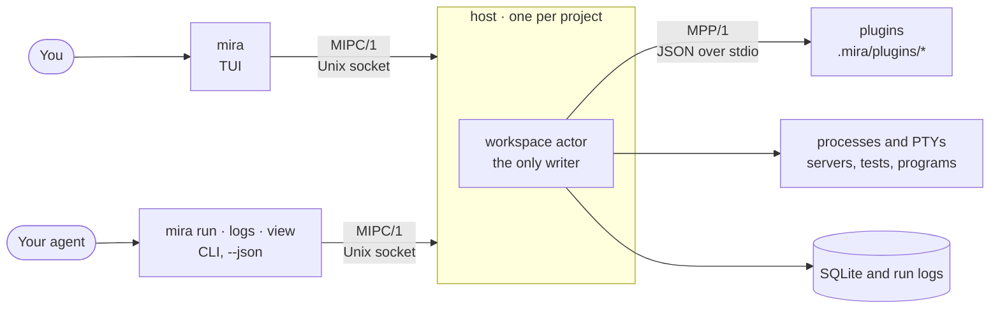

<p align="center">
  
</p>

<h1 align="center">Mira</h1>

<p align="center">
  <strong>Everything you run, in one terminal view that you shape and your agent reads exactly as you do.</strong>
</p>

<p align="center">
  <a href="https://github.com/ImHangLi/mira/releases/latest"></a>
  
  <a href="LICENSE"></a>
</p>

<p align="center">
  <a href="#quick-start">Quick start</a> ·
  <a href="#why-mira">Why Mira</a> ·
  <a href="#how-it-works">How it works</a> ·
  <a href="#set-it-up">Set it up</a> ·
  <a href="docs/guide.md">Guide</a>
</p>

<p align="center">
  <picture>
    <source media="(prefers-color-scheme: dark)" srcset=".github/assets/mira-demo-0.14.1-dark.gif">
    
  </picture>
</p>

## Quick start

```sh
curl -fsSL https://raw.githubusercontent.com/ImHangLi/mira/main/scripts/install.sh | sh
```

Then pick one:

- **With an agent:** in your project, ask it *"Set up Mira for this repo."* Then run `mira`.
- **By hand:** in your project, save a command you already use, then open Mira:

  ```sh
  mira save "Unit tests" -- npm test
  mira
  ```

Mira is one native binary. It runs no AI and sends nothing about your projects. Its only automatic network call is a once-a-day check for a new version. Turn it off with `MIRA_NO_UPDATE_CHECK=1`.

Update with `mira update`. Restore the previous binary with `mira update --rollback`.

## Why Mira

**The problem.** A normal day is spread over terminal tabs: the dev server in one, tests in another, a Docker log you grep by hand, a command you look up again every week. Coding agents make it worse. They run migrations and tests in terminals nobody watches, and you learn what happened from their summary. Each new session, they work out the same commands again.

**Mira's answer.** Everything you run lives in one view, and your agent sees that same view.

| | Without Mira | With Mira |
|---|---|---|
| Your commands | Spread over tabs and shell history | One list of tools: Enter runs a tool, `s` starts or stops it |
| Logs | Scroll and grep by hand | Live logs per tool, and filtered views such as "only errors" |
| Your agent's runs | Hidden in its own terminal | Shown in your view as they run, one section per agent |
| A command worth keeping | Found again every session | Saved once as a plugin, reused by you and every agent |
| Sharing a tool | Write a wiki page | Commit a plugin folder, or send a prompt that rebuilds it |

**What you get:**

- **One place for everything you run.** Dev servers, tests, checks, `top`, a Docker log with only the errors. Services keep running while you look at other tools.
- **Built entirely from plugins.** A plugin is a folder with a `plugin.json`. A log filter is six lines of JSON. A dev server is one command. A timer, a table, or a whole terminal program is a plugin too.
- **Your agent sees what you see, natively.** Agents use the same `mira` CLI with `--json`. No MCP server, no extra protocol. Their runs show up in your view while they happen.
- **Programs live inside Mira.** Select Pomodoro, Snake, or the system monitor and its screen opens in the main pane. Press Enter to type into it and **Ctrl-T** to go back to your tools.
- **Not only for code.** A focus timer, a scheduled check, a morning update: anything you run in a terminal.

## How it works

Mira is one binary, `mira`. It runs as a TUI for you, a CLI for your agent, and one host per project. The host owns every fact, so both views always agree.



- **One host per project.** The first `mira` command starts it. It runs every process, keeps the logs and the run history, and stops what it started when the last window closes. It records every process group on disk, so it can clean up after a crash.
- **One protocol for people and agents.** The TUI and the CLI both talk JSON-RPC 2.0 to the host over a Unix socket (MIPC/1). What your agent reads is exactly what you see.
- **Plugins are plain files.** `.mira/workspace.json` lists them. Each `plugin.json` is checked against a JSON Schema before it loads, and a bad field fails with its exact path. Save a file and Mira loads it again by itself.
- **Plugins that need logic** read one JSON line on stdin and write JSON frames on stdout (MPP/1): results, progress, tables, logs, and desktop notifications.
- **Safe by default.** Nothing starts unless you or your agent ask. A table row action asks before it runs. Two clients never type into the same program at once.

Written in Rust (`tokio`, `ratatui`, `portable-pty`, `rusqlite`). The details are in [docs/architecture.md](docs/architecture.md).

## Set it up

### With an agent

Ask your agent *"Set up Mira for this repo."* It installs Mira, adds its skills to your agent's skills folder, reads your repository, writes the plugins, and checks each one. It asks you two questions: whether to share `.mira/` with your team, and which of the default plugins you want.

> [!TIP]
> **Are you an agent?** Follow [docs/agents.md](docs/agents.md). It lists every step, and where each file goes.

### By hand

1. Install Mira with the command in [Quick start](#quick-start).
2. Save the commands you already use. Each one becomes a tool, is checked, and loads at once:

   ```sh
   mira save "Unit tests" -- npm test
   mira save "Web app" --service -- npm run dev
   ```

3. Need more (inputs, views, schedules)? Write the plugin yourself. For example, `.mira/plugins/dev/plugin.json`:

   ```json
   {
     "api": 1, "id": "dev", "name": "Dev", "description": "Project commands.",
     "actions": [
       {"id": "web", "title": "Web app", "description": "Start the dev server.",
        "mode": "process", "run": {"kind": "command", "argv": ["npm", "run", "dev"]}},
       {"id": "test", "title": "Unit tests", "description": "Run the tests once.",
        "mode": "task", "run": {"kind": "command", "argv": ["npm", "test"]}}
     ]
   }
   ```

   List it in `.mira/workspace.json`:

   ```json
   {"api": 1, "name": "My project", "plugins": ["plugins/dev"], "autostart": []}
   ```

   Then run `mira validate .mira`, and `mira`.

A live filter over the dev server's log, with no code:

```json
{"api": 1, "id": "watch", "name": "Watch", "description": "Live filters over other tools.",
 "views": [{"id": "errors", "title": "Web errors", "kind": "log",
            "source": {"logs": "dev.web", "grep": "Error:"}}]}
```

The [guide](docs/guide.md) covers every kind of plugin: tables, schedules, terminal programs, and plugins with inputs.

## Default plugins

Mira ships four plugins that work in any project. Add one with `mira plugin add NAME`, or press `+` in the TUI.

| Plugin | What it does |
|---|---|
| `notes` | A Markdown notes page. Edit it in place, or let your agent edit `.mira/plugins/notes/notes.md` and watch it update. |
| `system` | A live system monitor: CPU per core, memory, disk, network, and the busiest processes. |
| `pomodoro` | A focus timer with breaks and a daily count. It notifies you when a session ends. |
| `snake` | A game of Snake, for the build that takes too long. |

Each one becomes ordinary files in `.mira/plugins/NAME/`. Read them, change them, or remove them with `x`.

## Keys

| Key | Does |
|---|---|
| `j` / `k` | Move through the tools |
| `Enter` | Run a task, start a service, open a view, or type into a program |
| `s` | Start or stop the selected tool |
| **`Ctrl-T`** | Back to the tools from anywhere (also `Shift-Esc` and `Ctrl-]`) |
| `/` | Search the tools |
| `:` | Run a `mira` command, for example `:plugin add system` |
| `?` | Show every key that works here |
| Mouse | Click to select, double-click to open, wheel scrolls what is under the pointer; hold Shift to select text (`m` turns the mouse off). |

The footer shows the keys for what you have selected, most useful first.

## Share a plugin

- **With your team:** commit `.mira/workspace.json` and `.mira/plugins/`.
- **With anyone:** ask your agent to *"write a prompt that rebuilds this Mira plugin"*, and send the prompt. Their agent makes the same tool, fitted to their project.

## Learn more

- [Guide for people](docs/guide.md): setup, your first plugin, every kind of plugin, and sharing.
- [Setup for agents](docs/agents.md): the steps an agent follows.
- [Architecture](docs/architecture.md): processes, protocols, and crates.
- [Example plugins](examples/plugins/): a command with inputs, a table with a row action, a service, a derived log view, and a routine.

## License

[MIT](LICENSE)
