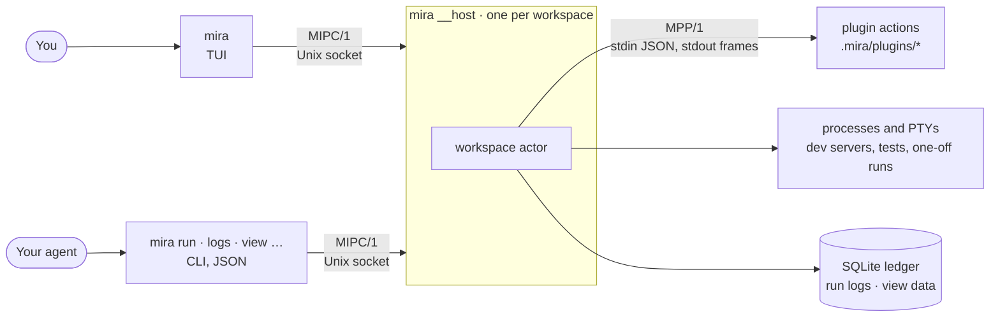
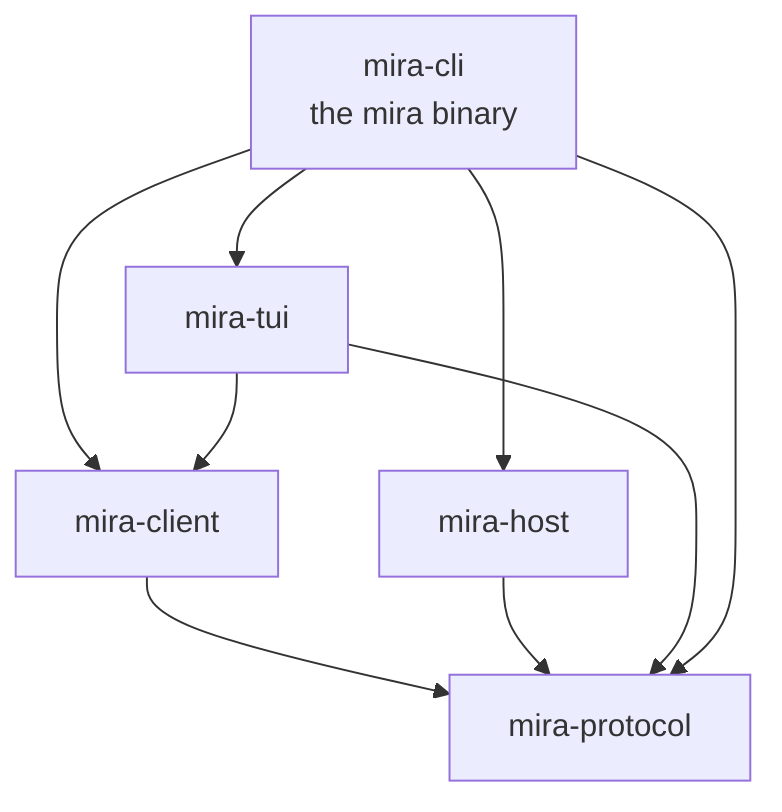
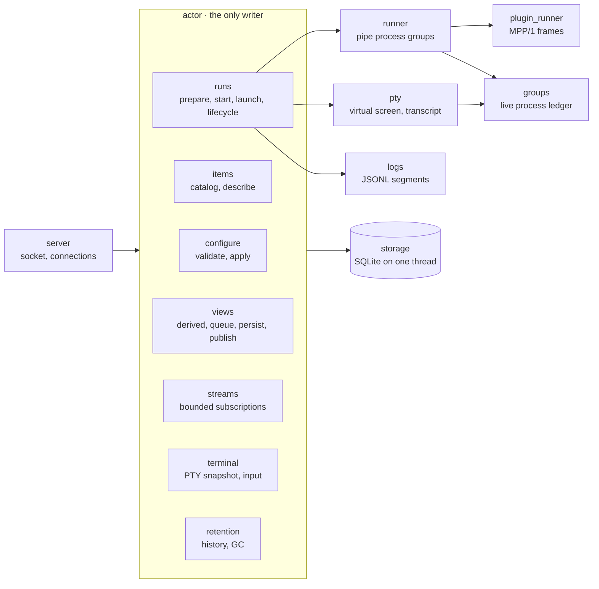
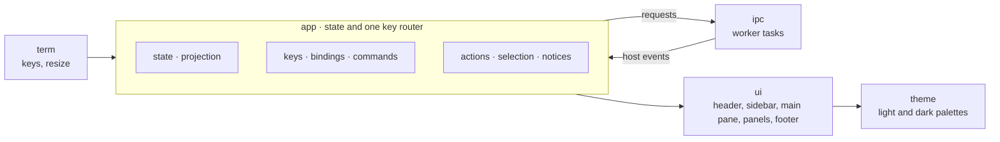

# Architecture

Mira is one binary, `mira`. It runs as three kinds of process: the TUI for people, the CLI for agents and scripts, and one host per workspace. The host owns every fact. The TUI and the CLI are two views of the same host, over the same protocol.

## Processes

- **MIPC/1** is JSON-RPC 2.0 over a Unix socket in the runtime folder (`mira paths`). A client starts the host when none is running. The host exits when idle, unless a session keeps it: an open TUI, or a background lease from `mira up --background`.
- **MPP/1** is how a plugin action reports results, health, progress, and view data. A plain command needs no protocol at all.
- Nothing starts unless a person or an agent asks. The host records every child process group on disk, so it can clean up after a crash.

## Crates

The graph has no cycles. `mira-protocol` depends on no other Mira crate. The TUI and the CLI reach the host only through `mira-client`. `mira-cli` links `mira-host` only to run it as `mira __host`.

| Crate | Owns |
|---|---|
| `mira-protocol` | The contract: IDs, manifests, MIPC/1 and MPP/1 messages, run and view types, errors, limits, and the generated JSON Schemas in `schemas/`. Also the small rules both sides share: catalog ranking and clock text. |
| `mira-host` | The per-workspace host: the socket, the workspace actor, the process and PTY runners, run logs, and storage. |
| `mira-client` | A typed MIPC/1 client, shared by the CLI and the TUI. It finds or starts the host. |
| `mira-tui` | The human TUI: a projection of host state. It holds presentation state only. |
| `mira-cli` | Argument parsing, one command module per command group, and the output rules (`--json` for agents, text for people). |

## Inside the host

One actor task owns all workspace state, so there are no locks around it. Runners report facts to the actor as messages. Storage runs on its own thread, and only the actor calls it.

## Inside the TUI

The UI never waits on IPC. Requests go to worker tasks, and their results come back as events. Each frame draws from the current state only.

## Repository

| Path | Contents |
|---|---|
| `crates/` | The five crates above. |
| `schemas/` | JSON Schemas generated from `mira-protocol`. `scripts/check-contract.sh` fails when they drift. |
| `skills/` | The agent skills that `mira skills export` copies: `mira` (use tools) and `mira-extend` (write plugins). |
| `plugins/` | The default plugins that `mira plugin add NAME` copies into a project: `pomodoro`, `ports`, and `snake`. Built into the binary like the skills. |
| `examples/plugins/` | A workspace of example plugins: a command with inputs, a table with a row action, a service, a derived log view, and a routine. |
| `tests/fixtures/` | The workspace the tests run on, and invalid manifests the validator must reject. |
| `scripts/` | The installer, the release packager, and the contract check. |
| `docs/agents.md` | Setup steps for an agent. |
